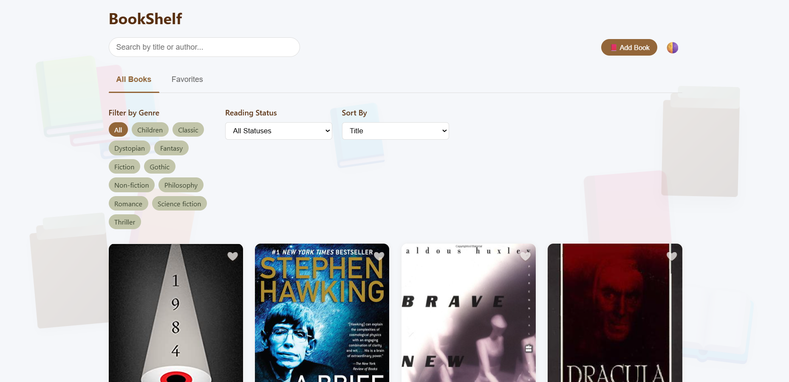
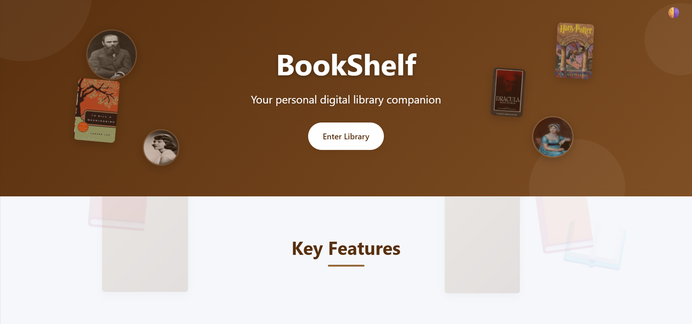

# 📚 BookShelf - Personal Book Collection App

A responsive web application to organize, track, and manage your personal book collection with a clean and user-friendly interface.

---

## ✨ Features

- 🌓 **Elegant UI with Light & Dark Mode** – Earth-toned theme with smooth theme switching  
- 📚 **Manage Your Book Collection** – Add, edit, and delete books easily  
- 🔖 **Favorites Toggle** – Mark/unmark your favorite books and filter by them  
- 📊 **Reading Status Tracker** – Organize books by reading status: Want to Read, Reading, Finished  
- ⭐ **Rating System** – Add star-based ratings for each book  
- 📋 **Genre Filter** – Quickly browse books by genre  
- 🔍 **Search Functionality** – Search books by title or author  
- 🎨 **Smooth Animations** – Transitions and hover effects for better UX  
- 💾 **Persistent Storage** – Uses localStorage to save your library  
- 📱 **Responsive Design** – Fully functional on desktop, tablet, and mobile  

---

## 🖥️ UI Screenshots

### 📚 BookShelf Library  


### 🏠 Landing Page  


---

## 🔗 Live Demo

Visit the live application: [BookShelfBrowse](https://bookshelfbrowse.netlify.app/)

---

## 🛠 Tech Stack

- **HTML5**  
- **CSS3** (Custom properties, Flexbox, Grid, Animations)  
- **Vanilla JavaScript (ES6+)**  
- **Local Storage** for persistent data  

---

## 🚀 Installation

1. **Clone this repository:**

   ```bash
   git clone https://github.com/himanshiyenugupalli/bookshelf-web-app.git
